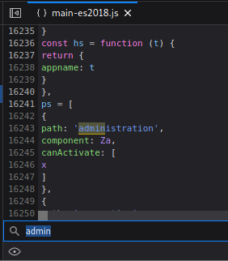
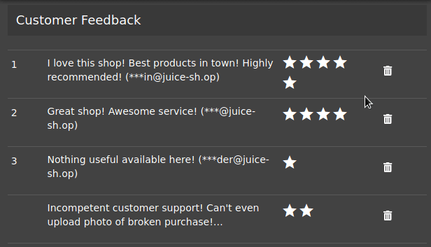
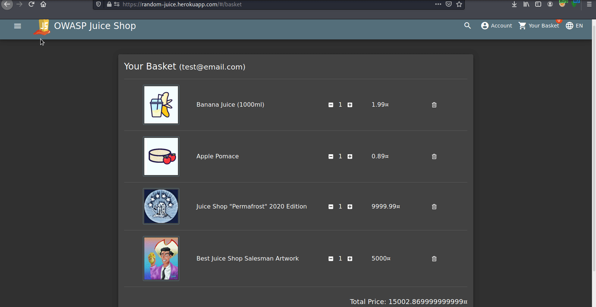

# Level 2

After completing all the [Level 1](https://www.notion.so/Level-1-47b98fa6006145e59836f6a5e006bdd4) challenges, now its time for Level 2. The Level 2 challenges are definitely bit harder than those of Level 1 but can be solved easily with some efforts.

# Login To the Administrator's Account

Whenever it is about admin, the first that should come to our mind is default credentials, simple SQLi or brute-force attack. So, first we can go to the login page and try combination of some of the basic usernames and passwords like:

| Username      | Password |
|---------------|----------|
| admin         | admin    |
| administrator | password |
| root          | pass     |

But apparently none of these work. So, we can try some simple SQLi like:

```bash
1' OR 1=1;
' OR TRUE;
```

And this worked, all that was needed to be done was to enter any of the above payload in the username and any random password (because it does not matter with this payload) and we get logged in to the admin account.

So, what is happening over here is:

- Usually when a users database is created the first entry that is created belongs to the admin and when we enter the above payload it gets executed somewhat like:

    ```sql
    SELECT * FROM users WHERE username='1' OR 1=1;' AND password='<passed value>'
    ```

    Where the original query is like:

    ```sql
    SELECT * FROM users WHERE username='<passed username>' AND password='<passed password>'
    ```

- Now, because of the `OR 1=1` part in our payload the query always turns out to be true. (Also, this returns the first entry that is stored in the table)
- The next part is the `;`, this semi-colon basically marks the end of the SQL statement and anything after this is considered as a comment because of which the `' AND password='<passed password>` is processed as a comment rather than a check for correct password being passed or not.

    

And **with a simple SQLi, we get access as the admin**.

# Access the Administration Section of the Store

Now, that we have the access to the administrators account, we can start to look for the administration section. We can visually inspect all the links visible to us and check if we can find a link to the administrative section but can't find any direct link. So, again just like some of the Level 1 tasks, we can go and check the `main-es2018.js` file to see if some path is mentioned over there to the administrative section.



And with **just a simple search for the term "admin" we get the path to the administrative section.**


# Get Rid of All 5-Star Customer Feedback

This is some really destructive work :P. From the previous challenges, we were able to get to administrative section where we can see all the customer feedback. Now, all that **we need to do is just delete all the 5-star feedback from the administration page**!



# Behave Like Any “White-Hat” Should Before Getting Into the Action

So, the answer to this question appears to be a pretty much straight-forward. There are a few things that any pentester should do before starting the pentest, which are:

- Read the privacy policy of the target
- Inform the authorities about the pentest
- Get proper approval before getting started

In case of Juice Shop, we can check the privacy policies from the privacy policy page that was found in Level 1. There we can find an email, where a mail can be sent but nothing related to a pentest can be found over there. Even after digging a lot no useful information can be found. 

But when we check the official guide for OWASP Juice Shop, they have mentioned a file named `security.txt`. And when we **go to the link: [https://random-juice.herokuapp.com/security.txt](https://random-juice.herokuapp.com/security.txt), we find the same details which are present in the privacy policy over there.**


# Use a Deprecated B2B Interface That Was Not Properly Shutdown

Now that we have explored the entire UI of the web app we can come to one clear point that this app is meant for B2C purpose i.e. Business to Customer. But the challenge here is to find an endpoint that is associated with B2B i.e. Business to Business interface. So, the best way to look for this is to run a directory traversal attack against the web app to check and find if there is any page or portal that was earlier used for any B2B purpose. And meanwhile we can manually check the the JS files for keywords like *B2B, shutdown, closed etc*.


With the first search only, we can find that there was an option to upload XML files for B2B orders. **So, all we need to do is just go to the complaint section and upload any random XML file as the invoice.**

# View Another User’s Shopping Basket

The best was to access someone else's shopping basket would be to first understand how our own basket loads. To test the same, we can add a few items in our own basket and then intercept the traffic when we access our basket.

**Steps:**

- Create a new account and login with the same
- Add items to the basket
- Go to the basket
- Check the traffic that was generated when the link to the basket was accessed

While checking the traffic generated when the basket is accessed, a URL can be found which mentions "**basket**" in it. So, it might be the case that it is being used to access the right basket based on the value passed next to it.


So, we can try to change the value next to `/basket/<value>` in the URL and check if we can access someone else's cart. But when we try to access the URL from a browser it returns a 401 error.


To resolve this issue, we can add a breakpoint to the basket request, manipulate it, forward the same and check if someone else's basket is returned.

In the GIF below, the basket showing first our own basket. When we refresh the basket page, the request is intercepted on OWASP Zap where we can change the basket value from 6 to 1 and on the web page we can then see the content of basket number 1.



# Login With the Administrator’s User Credentials Without Previously Changing Them or Applying SQL Injection

So, in the first Level 2 challenge itself we logged in as admin using SQLi but here SQLi is out of scope and we need to find the correct password for the account. So, the only options we have is to guess the correct password or brute-force the same. To do so, we can combine the two things by running the a brute-force attack using a list of some default credentials. 

>  One thing to note is that the username for admin account is `admin@juice-sh.op` which we found when logged in as the admin using SQLi

To perform the brute-force attack, OWASP Zap can be used. All we need to do is capture a login request and start Fuzzing the password value with a list of password.


And there we get the password for admin account through brute-forcing. 

> The list that I used was `seclists/Passwords/cirt-default-passwords.txt` which can be found at [https://github.com/danielmiessler/SecLists/blob/master/Passwords/cirt-default-passwords.txt](https://github.com/danielmiessler/SecLists/blob/master/Passwords/cirt-default-passwords.txt)

# Determine the Answer to Emma’s Security Question by Looking at an Upload of Her to the Photo Wall and Use It to Reset Her Password via the Forgot Password Mechanism

First, we need to find Emma's email address only then we will be able to login to her account. Now that we have access to the "**administration section**", we can get her email address from there and then move on to the "**Forgot Password**" page where we can see the security question "Company you first work for as an adult?" after entering Emma's email address. Now, we need to find the answer to this question from the photo Emma has uploaded on the Photo Wall.


The first thing that could come to one's mind when there is an image is to check its Exif data. So, we can save the image and pass it to `exiftool` and check if it has some useful information.

```sql
┌──(kali㉿kali)-[~/Downloads]
└─$ exiftool IMG_4253.png 
ExifTool Version Number         : 12.16
File Name                       : IMG_4253.png
Directory                       : .
File Size                       : 6.0 MiB
File Modification Date/Time     : 2021:03:11 16:18:48-05:00
File Access Date/Time           : 2021:03:13 18:53:26-05:00
File Inode Change Date/Time     : 2021:03:11 16:18:48-05:00
File Permissions                : rw-r--r--
File Type                       : PNG
File Type Extension             : png
MIME Type                       : image/png
Image Width                     : 2270
Image Height                    : 3022
Bit Depth                       : 8
Color Type                      : RGB
Compression                     : Deflate/Inflate
Filter                          : Adaptive
Interlace                       : Noninterlaced
SRGB Rendering                  : Perceptual
Gamma                           : 2.2
Pixels Per Unit X               : 3779
Pixels Per Unit Y               : 3779
Pixel Units                     : meters
Image Size                      : 2270x3022
Megapixels                      : 6.9
```

But no useful information can be found here. We can use Yandex and Google Image Search as well to find any similar photo but there is nothing particular about this photo and hence we can see a large number of results after reverse image search which are similar to the same building but none of them turns out to be our solution.

There is still one thing that we can do, which is to inspect the image visually. And while doing so, we can see that on one of the windows it is written "IT Sec", which might be the answer to our question. Also, no other meaningful information can be interpreted from the image. So, we can try to enter this as the answer to the question and see if works. It does not work directly so we can try to modify the caps and spaces and then try:

```sql
IT Sec
ITSec
IT sec
ITsec
```

**The one that works is "ITsec" through which we can change Emma's password and log in to her account.**

# Determine the Answer to John’s Security Question by Looking at an Upload of Him to the Photo Wall and Use It to Reset His Password via the Forgot Password Mechanism

Again, we first need to get John's email address from the administration section after which we can check his security question "**What's your favorite place to go hiking?**" from the "Forgot Password" page. Now that we know the question we can start analyzing the image that he has uploaded on the Photo Wall.

This time also, we can follow the same procedure as we did for Emma and check the Exif data first.

```sql
┌──(kali㉿kali)-[~/Downloads]
└─$ exiftool favorite-hiking-place.png 
ExifTool Version Number         : 12.16
File Name                       : favorite-hiking-place.png
Directory                       : .
File Size                       : 651 KiB
File Modification Date/Time     : 2021:03:13 19:10:07-05:00
File Access Date/Time           : 2021:03:13 19:10:07-05:00
File Inode Change Date/Time     : 2021:03:13 19:10:07-05:00
File Permissions                : rw-r--r--
File Type                       : PNG
File Type Extension             : png
MIME Type                       : image/png
Image Width                     : 471
Image Height                    : 627
Bit Depth                       : 8
Color Type                      : RGB
Compression                     : Deflate/Inflate
Filter                          : Adaptive
Interlace                       : Noninterlaced
Exif Byte Order                 : Little-endian (Intel, II)
Resolution Unit                 : inches
Y Cb Cr Positioning             : Centered
GPS Version ID                  : 2.2.0.0
GPS Latitude Ref                : North
GPS Longitude Ref               : West
GPS Map Datum                   : WGS-84
Thumbnail Offset                : 224
Thumbnail Length                : 4531
SRGB Rendering                  : Perceptual
Gamma                           : 2.2
Pixels Per Unit X               : 3779
Pixels Per Unit Y               : 3779
Pixel Units                     : meters
Image Size                      : 471x627
Megapixels                      : 0.295
Thumbnail Image                 : (Binary data 4531 bytes, use -b option to extract)
GPS Latitude                    : 36 deg 57' 31.38" N
GPS Longitude                   : 84 deg 20' 53.58" W
GPS Position                    : 36 deg 57' 31.38" N, 84 deg 20' 53.58" W
```

Here, we have found a very useful information which is the GPS Coordinates of the location where the picture was clicked. But first we need to convert these sexagesimal degree coordinates to decimal coordinates. For this purpose we can use many tools that are available online and one such tool is [this](https://www.gps-coordinates.net/gps-coordinates-converter). All we need to do is just enter the GPS coordinates that we have obtained from the image details and we will get the decimal coordinates. We need to do this because Google Maps understands decimal coordinates only.


Now, we can copy the decimal degree and search for the same in Google Maps. 

But when we look for the location in Google Maps, it can be seen that this location is in some remote forest area and there are not many places close to the coordinates. So, we can make a list of all the places nearby and then pass the same to **OWASP Zap Fuzzer**. Some of the locations close to the coordinates are:

```sql
Laurel County School District
Laurel County School
Laurel County 
Scuttlehole Trailhead
Goodin Branch
Dutch Branch
Rockcastle Campground
Daniel Boone National Forest
Holly Bay Campground
Mt Victory
Cumberland River
```

And after fuzzing, we get the correct answer to this question which is "**Daniel Boone National Forest**" using which we can reset John's password.


# Log In With MC SafeSearch’s Original User Credentials Without Applying SQL Injection or Any Other Bypass.

This challenge is a bit different and enjoyable also! 

Again the first thing that we need is MC SafeSearch's email, which can be found in the "Administration Section" but this time we don't have any image or anything other than the username itself. So, we need to start looking for the person himself and see if we can find some useful information about him.

And apparently the first link that comes up on a quick Google search is a song by MC SafeSearch called "[Protect Ya Passwordz (2014)](https://www.youtube.com/watch?time_continue=12&v=v59CX2DiX0Y&feature=emb_logo)". So, we can start listening to the song along with reading the description and comments. 

While listening to the song itself, SafeSearch tells his own password in the lines 

> Why not use the first name of your favorite pet.
Mine's my dog Mr. Noodles
It don't matter if you know
Cuz I was tricky and replaced some vowels with zero

So, now we know that his pet's name is Mr. Noodles and he has replace o's with 0's in his password. So, the correct password is "**Mr. N00dles**", using which we can log in to MC SafeSearch's account!

# Inform the Shop About an Algorithm or Library It Should Definitely Not Use the Way It Does.

This one was a bit tricky as we haven't yet come across any algorithm or library. So, we can just randomly try some algorithms like MD5, SHA1, RSA, etc. and send them through the customer feedback page. Apparently, MD5 worked for solving this.

# Reference Links:

1. OWASP Juice Shop Level 1: [https://0xnirvana.medium.com/owasp-juice-shop-level-1-2bb04f14375b](https://0xnirvana.medium.com/owasp-juice-shop-level-1-2bb04f14375b)
2. CIRT Default Password: [https://github.com/danielmiessler/SecLists/blob/master/Passwords/cirt-default-passwords.txt](https://github.com/danielmiessler/SecLists/blob/master/Passwords/cirt-default-passwords.txt)
3. Sexagesimal Degree to Decimal Degree Coordinates: [https://www.gps-coordinates.net/gps-coordinates-converter](https://www.gps-coordinates.net/gps-coordinates-converter)
4. MC SafeSearch - Protect Ya Passwordz (2014): [https://www.youtube.com/watch?time_continue=12&v=v59CX2DiX0Y&feature=emb_logo](https://www.youtube.com/watch?time_continue=12&v=v59CX2DiX0Y&feature=emb_logo)